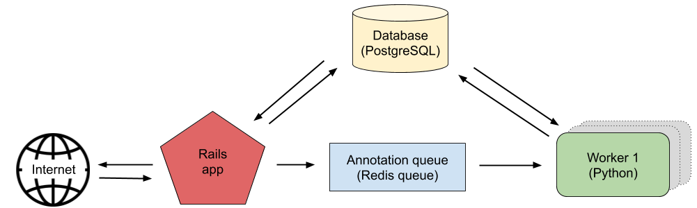
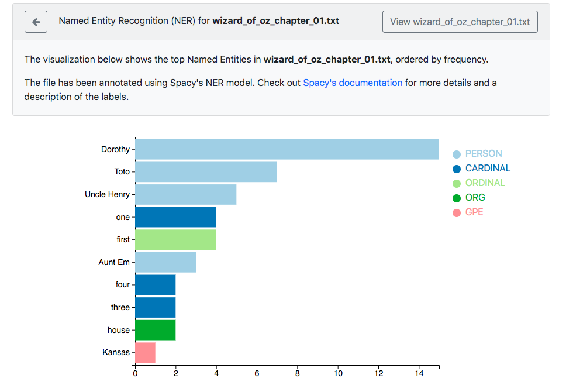

# NLP4DH
> The idea of NLP4DH (Natural Language Processing for Digital Humanities) is to allow
researchers in the humanities to automatically analyze their research texts with
modern Machine Learning and Natural Language Processing methods.

> This project is still in _progress_! At the moment, it supports Named Entity Recognition.

## Live demo
https://pacific-peak-48335.herokuapp.com

## Table of contents
* [General info](#general-info)
* [Screenshots](#screenshots)
* [Technologies](#technologies)
* [Setup](#setup)
* [Tests](#tests)
* [Background](#Background)
* [Contact](#contact)

## General info
Most Machine Learning packages are written in Python. Because of that &mdash;even though this app is a Ruby on Rails app&mdash; the worker was written in Python. A Redis queue connects these two components.

When a user uploads a new text file, [Resque](https://github.com/resque/resque) is used to push its ID onto the Redis queue. The Python worker is set up with [RQ](https://python-rq.org/) to continuously check for IDs in the queue. Once it gets a new ID, it retrieves the document's content from the database, passes it through the Machine Learning models and adds the new information to the database.



## Screenshots


## Technologies
* Ruby on Rails
* Python
* Redis
* PostgreSQL
* D3.js

## Setup

The setups steps assumes the following tools are already installed.

- Ruby - version 2.6.3
- Rails - version 6.0.2.2
- Python - version 3.7.7

### Rails app setup
##### 1. Create and setup the database
Run the following commands to create and setup the database.
```ruby
bundle exec rake db:create
bundle exec rake db:setup
```
##### 2. Install dependencies
Using [Bundler](https://github.com/bundler/bundler) and [Yarn](https://github.com/yarnpkg/yarn):
```shell
bundle && yarn
```
##### 3. Serve
```shell
rails s
```
Make sure that you also have a Redis server running. The command to start it up is:
```shell
redis-server
```
### Python worker setup
##### 1. Install requirements
In a virtual environment, run:

```shell
pip install -r requirements.txt
```

##### 2. Serve
Keep this running continuously!
```shell
python lib/python/worker.py
```

## Tests
Tests are still _in progress_ and will be added soon.

## Background
This project is a hobby-reimplementation of [a project I worked on at the
University of Colorado Boulder](https://nlp4dhinstructionsmainpage.home.blog/).

## Contact
Created by [@annebeth](http://annebeth.io) - feel free to contact me!
